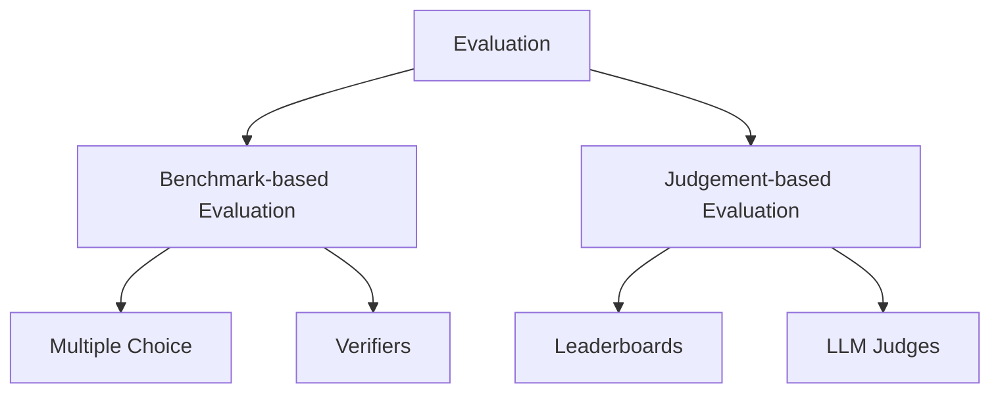

## Reasoning Evaluation

```mermaid
flowchart TD
    A[Evaluation]
    B[Benchmark-based Evaluation]
    C[Judgement-based Evaluation]
    D[Multiple Choice]
    E[Verifiers]
    F[Leaderboards]
    G[LLM Judges]

    A --> B
    A --> C

    B --> D
    B --> E

    C --> F
    C --> G
```

